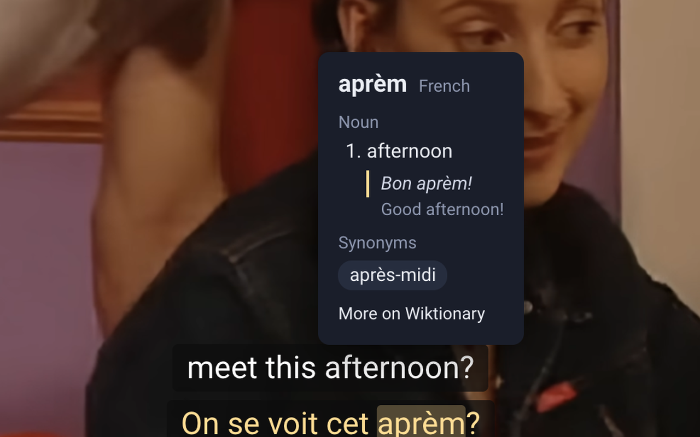

# Dual Subtitles for YouTube

A Chrome extension that shows YouTube subtitles in two languages at once, with a hover
tooltip giving definitions, example sentences and synonyms from Wiktionary, and an optional
voice-over that reads a subtitle line aloud.

## What it does

- Draws two subtitle lines over the player in any pair of 32 languages (French and English
  by default), using the caption track the YouTube player itself requested — including
  auto-translated tracks.
- Hovering a word shows its part of speech, definitions, an example sentence and synonyms,
  with a link to the full Wiktionary entry. Inflected forms are resolved to their base word
  (*allons* → *aller*), and French elisions (*l'*, *qu'*, *d'*) are stripped before lookup.
- Optionally pauses the video while you read the tooltip.
- Voice-over: reads the top or bottom line aloud with your choice of voice and speed, lowers
  the original audio while it speaks, and can pause the video if the voice falls behind.
  Toggle it with **Alt+Shift+V** or the speaker button in the YouTube player.
- Styling per line: colour, size, bold, italic and font, plus background colour, box
  opacity, text outline and how high the subtitles sit. The popup shows a live preview.
- Everything is toggleable from the popup: which lines show, swapping top and bottom,
  hiding YouTube's own captions, word lookup, examples and synonyms.

## Install

**[⬇ Download dual-subs-1.6.1.zip](https://github.com/jasrajsinghbedi/dual-subs/releases/latest/download/dual-subs-1.6.1.zip)** — or grab it from the [releases page](https://github.com/jasrajsinghbedi/dual-subs/releases/latest). You can also `git clone` this repo.

1. Unzip the download.
2. Open `chrome://extensions` and turn on **Developer mode**.
3. Click **Load unpacked** and pick the unzipped folder.
4. Open any YouTube video that has captions.

After updating, reload the extension on `chrome://extensions` and refresh open YouTube tabs.

## How it works

| File | Role |
| --- | --- |
| `inject.js` | Runs in the page's own world and watches `fetch`/`XMLHttpRequest` for the player's `/api/timedtext` call. YouTube's caption URLs carry a signed token, so reusing the player's URL is far more reliable than building one. |
| `content.js` | Fetches the chosen two languages of that track, draws the overlay, renders the lookup tooltip and drives the voice-over. |
| `background.js` | Queries Wiktionary (and Datamuse for extra English synonyms) from the service worker, because YouTube's CSP blocks those requests from the page. Also speaks subtitles with `chrome.tts` and handles the keyboard shortcut. |
| `shared.js` | Language list, default settings and style helpers shared by the popup and the overlay. |
| `popup.html` / `popup.js` | Settings with a live preview, stored in `chrome.storage.sync`. |
| `overlay.css` | Overlay and tooltip styling. |

## Privacy

No servers, no accounts, no analytics. The only thing that leaves your machine is the single
word you hover, sent to Wiktionary (and Datamuse for English synonyms) to look it up. The
voice-over uses Chrome's text-to-speech; if you pick one of Chrome's online "Google" voices,
Chrome sends the subtitle text to Google to speak it.
Full policy: https://jasrajsinghbedi.github.io/dual-subs-privacy/

## Credits

Definitions, examples and synonyms come from [Wiktionary](https://en.wiktionary.org/),
licensed under CC BY-SA. Extra English synonyms come from [Datamuse](https://www.datamuse.com/api/).
